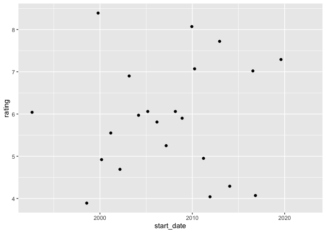

<!-- README.md is generated from README.Rmd. Please edit that file -->

# anidb

<!-- badges: start -->
<!-- badges: end -->

`anidb` is an R-package that returns information from the anime database
at [AniDB](https://anidb.net). **You should not use this package to
request the same dataset multiple times on a single day or flood it with
requests – otherwise you can get banned by the AniDB administrators.**
If using `Rmd`, you should add `cache = TRUE` in chunks. For interactive
use, `anidb` employs a simple caching mechanism.

## Installation

You can install the development version of anidb from
[GitHub](https://github.com/) with:

``` r
# install.packages("devtools")
devtools::install_github("emitanaka/anidb")
```

## Example

``` r
library(anidb)
```

Get all IDs with anime titles that has an approximate matching with “one
piece” ignoring case:

``` r
aids <- anime_id(title = "one piece")
```

You can check the official titles of these anime IDs:

``` r
official_title(aids)
#>  [1] "One Piece"                                                                    
#>  [2] "One Piece (2000)"                                                             
#>  [3] "One Piece: Nejimakijima no Bouken"                                            
#>  [4] "One Piece: Chinjuujima no Chopper Oukoku"                                     
#>  [5] "One Piece The Movie: Dead End no Bouken"                                      
#>  [6] "One Piece: Norowareta Seiken"                                                 
#>  [7] "One Piece: Omatsuri Danshaku to Himitsu no Shima"                             
#>  [8] "One Piece: Taose! Kaizoku Ganzack"                                            
#>  [9] "One Piece The Movie: Karakurijou no Mecha Kyohei"                             
#> [10] "One Piece: Episode of Arabasta - Sabaku no Oujo to Kaizoku-tachi"             
#> [11] "One Piece The Movie: Episode of Chopper Plus - Fuyu ni Saku, Kiseki no Sakura"
#> [12] "One Piece Special: Romance Dawn Story"                                        
#> [13] "One Piece Film: Strong World"                                                 
#> [14] "One Piece Film: Strong World - Episode 0"                                     
#> [15] "One Piece 3D: Mugiwara Chase"                                                 
#> [16] "One Piece 3D: Gekisou! Trap Coaster"                                          
#> [17] "One Piece Film: Z"                                                            
#> [18] "One Piece: Cry Heart"                                                         
#> [19] "One Piece Film: Gold"                                                         
#> [20] "Gekijouban One Piece: Stampede"                                               
#> [21] "Tokyo One Piece Tower: Tongari Shima no Dai Hihou"                            
#> [22] "Uchida Shungiku no Noroi no One-piece"                                        
#> [23] "One Piece Film: Red"
```

``` r
onepiece <- anime_info(aids)
```

``` r
head(onepiece)
#>    aid      type episode_count start_date   end_date       titles rating
#> 1   69 TV Series          1009 1999-10-20       <NA> One Piec....   8.39
#> 2  411     Movie             1 2000-03-04 2000-03-04 One Piec....   4.92
#> 3  893     Movie             1 2001-03-03 2001-03-03 One Piec....   5.55
#> 4 1253     Movie             1 2002-03-02 2002-03-02 One Piec....   4.69
#> 5 1254     Movie             1 2003-03-01 2003-03-01 One Piec....   6.90
#> 6 2036     Movie             1 2004-03-06 2004-03-06 One Piec....   5.97
#>   rating_votes rating_temp rating_temp_votes rating_review rating_review_votes
#> 1         8579        8.66              9293          8.68                  20
#> 2         2493        6.90              2512          6.66                   2
#> 3         2268        7.13              2285          6.41                   2
#> 4         2080        6.80              2092          4.99                   2
#> 5         2118        7.60              2133          7.91                   2
#> 6         1907        7.24              1927          4.00                   1
#>   related_anime similar_anime
#> 1  c(5691, ....  c(6662, ....
#> 2  69, Pare....  integer(....
#> 3  69, Pare....  integer(....
#> 4  69, Pare....  integer(....
#> 5  69, Pare....  integer(....
#> 6  69, Pare....  integer(....
```

``` r
library(ggplot2)
ggplot(onepiece, aes(start_date, rating)) + 
  geom_point()
#> Warning: Removed 1 rows containing missing values (geom_point).
```


